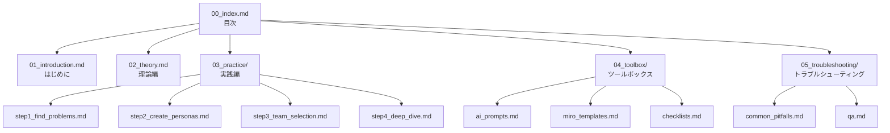

# ナビゲーションフロー設計

## 基本ナビゲーション構造



## リンク関係マトリクス

### 前後ナビゲーション
各ファイルの上部と下部に配置

| 現在のファイル | 前へ | 次へ |
|--------------|------|------|
| 00_index.md | - | 01_introduction.md |
| 01_introduction.md | 00_index.md | 02_theory.md |
| 02_theory.md | 01_introduction.md | step1_find_problems.md |
| step1_find_problems.md | 02_theory.md | step2_create_personas.md |
| step2_create_personas.md | step1_find_problems.md | step3_team_selection.md |
| step3_team_selection.md | step2_create_personas.md | step4_deep_dive.md |
| step4_deep_dive.md | step3_team_selection.md | ai_prompts.md |

### 相互参照リンク

#### step1_find_problems.md からのリンク
- → ai_prompts.md#困りごと発見プロンプト
- → checklists.md#step1チェックリスト
- → common_pitfalls.md#抽象的な困りごと

#### step2_create_personas.md からのリンク
- → ai_prompts.md#ペルソナ生成プロンプト
- → miro_templates.md#ペルソナシート
- → checklists.md#ペルソナ品質チェック

#### step3_team_selection.md からのリンク
- → miro_templates.md#合意形成ボード
- → common_pitfalls.md#チーム内対立
- → qa.md#チーム運営

#### step4_deep_dive.md からのリンク
- → ai_prompts.md#検証プロンプト
- → checklists.md#最終チェック
- → common_pitfalls.md#表面的な深掘り

## ナビゲーション要素の実装

### 1. ヘッダーナビゲーション（各ファイル上部）
```markdown
[🏠 目次](../00_index.md) | [◀ 前へ](previous.md) | [次へ ▶](next.md)
---
```

### 2. フッターナビゲーション（各ファイル下部）
```markdown
---
## 次のステップ
- [次へ: タイトル](next.md) - 簡単な説明
- [目次に戻る](../00_index.md)
- [困ったときは](../05_troubleshooting/qa.md)
```

### 3. 関連リンクセクション（必要に応じて）
```markdown
### 💡 関連リソース
- [AIプロンプト集](../04_toolbox/ai_prompts.md#relevant-section)
- [テンプレート](../04_toolbox/miro_templates.md)
- [よくある質問](../05_troubleshooting/qa.md#relevant-section)
```

## クイックアクセスパス

### 🚀 最速コース（30分）
1. 00_index.md（概要確認）
2. step1_find_problems.md（困りごと発見）
3. step2_create_personas.md（ペルソナ作成）
4. ai_prompts.md（プロンプト使用）

### 📚 標準コース（2時間）
1. 00_index.md
2. 01_introduction.md
3. 02_theory.md
4. step1～step4（順番に）
5. checklists.md（確認）

### 🔧 トラブル対応コース
1. 05_troubleshooting/qa.md
2. 05_troubleshooting/common_pitfalls.md
3. 該当するstepファイルへ

## ブレッドクラム実装

各ファイルの最上部に配置：
```markdown
ホーム > 実践編 > Step2: ペルソナを作る
```

## アンカーリンクの命名規則

- 日本語は避け、英語のみ使用
- ハイフンで単語を接続
- 例：`#find-problems-prompt`
- 例：`#persona-quality-check`

## アクセシビリティ考慮

- すべてのリンクに説明的なテキスト
- アイコンには代替テキスト
- 階層構造を明確に
- キーボードナビゲーション対応