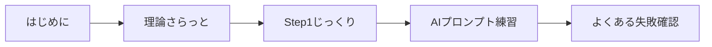
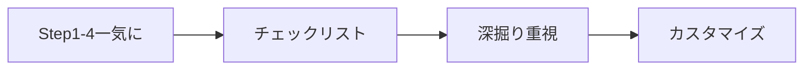
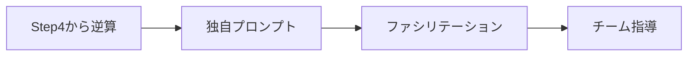

# 🎯 PBLフェーズ①実践ガイドブック

**「困りごと」から始める問題発見・ペルソナ作成の完全マニュアル**

---

## 🚀 クイックスタート（あなたの状況で選択）

<div style="background-color: #f0f8ff; padding: 15px; border-radius: 10px;">

### ⚡「今すぐ始めたい！」→ [30分最速コース](#quick-30min)
### 📚「しっかり理解したい」→ [標準2-3時間コース](#standard-course)  
### 👥「チームで取り組む」→ [チーム実践ガイド](#team-guide)
### ❓「困っている」→ [トラブルシューティング](05_troubleshooting/)

</div>

---

## 📖 このガイドブックについて

### 🎁 3つの成果物が手に入ります

<table>
<tr>
<td width="33%">

**📝 困りごとリスト**
```
1. 満員電車でスマホが使えない（毎朝30分）
2. 昼食の店が混んでいる（待ち時間15分）
3. Wi-Fiが不安定（週3回切断）
... 10個以上
```

</td>
<td width="33%">

**👤 詳細ペルソナ**
```
山田太郎（28歳）
ITエンジニア
困りごと：朝食時間なし
1日の流れ：...
価値観：効率重視
```

</td>
<td width="33%">

**🤝 チーム合意**
```
TOP3困りごと：
1. 通勤ストレス（4票）
2. 昼食混雑（3票）
3. 運動不足（3票）
```

</td>
</tr>
</table>

### 👥 対象者
- 🎓 PBLに取り組む学生・社会人
- 💡 AIツールは初めて/不慣れな方
- 👥 2-8名程度のチーム

### ⏱️ 所要時間
- ⚡ **最速**: 30分（必須のみ）
- 📚 **標準**: 2-3時間（推奨込み）
- 🔍 **じっくり**: 4-5時間（全部やる）

---

## 🗺️ ガイドブック全体構成

### 📑 このページの内容
- [クイックスタート](#quick-start)（1分）
- [全体構成](#structure)（2分）
- [目的別ガイド](#purpose-guide)（1分）
- [使い方のコツ](#tips)（2分）

---

### 🔴 必須セクション（これだけは読む）

#### 1️⃣ [はじめに](01_introduction.md) ⭐⭐⭐
> 🔴 **必須（5分）**
> - AIツールの準備
> - miroアカウント作成
> - 前提知識チェック

#### 3️⃣ 実践編 ⭐⭐⭐

<div style="border-left: 4px solid #ff6b6b; padding-left: 15px;">

**📍 [Step1: 困りごとを見つける](03_practice/step1_find_problems.md)**
- ⏱️ 15-30分 / 📊 困りごと10個以上
- AIプロンプトをコピペして量産

**👤 [Step2: ペルソナを作る](03_practice/step2_create_personas.md)**  
- ⏱️ 20-40分 / 📊 ペルソナ3-5体
- 30分で10体作る裏技あり

**🤝 [Step3: チームで選ぶ](03_practice/step3_team_selection.md)**
- ⏱️ 30-60分 / 📊 TOP3選定
- 投票で素早く決定

**🔍 [Step4: 深掘りする](03_practice/step4_deep_dive.md)**
- ⏱️ 30-60分 / 📊 検証済みペルソナ
- 品質を8/10まで向上

</div>

### 🟡 推奨セクション（できれば読む）

#### 2️⃣ [理論編](02_theory.md) ⭐⭐☆
> 💡 **3分で分かる核心**
> - 困りごと = 解決の種
> - N=1 = 一人を深く
> - ペルソナ = リアルな架空

#### 4️⃣ ツールボックス ⭐⭐☆

**🤖 [AIプロンプト集](04_toolbox/ai_prompts.md)**
- コピペ用プロンプト10種
- カスタマイズ方法

**🎨 [miroテンプレート](04_toolbox/miro_templates.md)**
- すぐ使えるボード4種
- オフライン代替案

**✅ [チェックリスト](04_toolbox/checklists.md)**
- 完了基準
- 品質スコア

### 🟢 任意セクション（困ったら読む）

#### 5️⃣ トラブルシューティング ⭐☆☆

**⚠️ [よくある落とし穴](05_troubleshooting/common_pitfalls.md)**
- 失敗パターン10選と対策

**❓ [Q&A集](05_troubleshooting/qa.md)**  
- よくある質問30選

---

## 🎯 目的別ガイド {#purpose-guide}

<details>
<summary>💭「AIの使い方が分からない」</summary>

1. [AIツール準備](01_introduction.md#ai-setup)
2. [基本プロンプト](04_toolbox/ai_prompts.md#basic)
3. [うまくいかない時](05_troubleshooting/qa.md#ai-trouble)

</details>

<details>
<summary>🤔「チームがまとまらない」</summary>

1. [合意形成の方法](03_practice/step3_team_selection.md#consensus)
2. [意見対立の解決](05_troubleshooting/common_pitfalls.md#team-conflict)
3. [ファシリテーション](03_practice/step3_team_selection.md#facilitation)

</details>

<details>
<summary>⏰「時間がない」</summary>

1. [30分コース](#quick-30min)
2. [優先順位](上記の⭐マーク参照)
3. [手抜きポイント](05_troubleshooting/qa.md#time-saving)

</details>

---

## ⚡ 30分最速コース {#quick-30min}

> 🚨 **タイマーをセットして開始！**

### 【0-5分】準備
1. ChatGPT/Claudeにログイン
2. miroにログイン（またはGoogleスライド準備）
3. このページをブックマーク

### 【5-15分】困りごと発見
1. [このプロンプト](04_toolbox/ai_prompts.md#quick-problems)をコピー
2. 自分の属性を追加してAIに投げる
3. 10個出たら次へ（完璧は求めない）

### 【15-25分】ペルソナ作成
1. [このプロンプト](04_toolbox/ai_prompts.md#quick-personas)をコピー
2. 困りごとを3つ選んでAIに投げる
3. 3体できたら次へ

### 【25-30分】まとめ
1. TOP1を選ぶ（直感でOK）
2. スクショを撮る
3. 完了！

> ✅ **成果物チェック**
> - 困りごと10個 → あれば○
> - ペルソナ3体 → あれば○
> - TOP1選定 → あれば○

---

## 📚 標準2-3時間コース {#standard-course}

### 【進捗トラッカー】
```
理論 [====] 100% ✅
Step1 [====] 100% ✅  
Step2 [===_] 75% ⏳
Step3 [____] 0%
Step4 [____] 0%
```

### タイムライン例（14:00スタート）
```
14:00-14:15 📖 理論編を読む
14:15-14:45 📍 Step1: 困りごと発見
14:45-14:50 ☕ 休憩
14:50-15:30 👤 Step2: ペルソナ作成  
15:30-15:35 ☕ 休憩
15:35-16:05 🤝 Step3: チーム選定
16:05-16:30 🔍 Step4: 深掘り
16:30-16:45 ✅ チェック&まとめ
```

---

## 💡 成功のコツ {#tips}

### 🌟 うまくいく人の特徴
- ✅ 完璧より完成を優先
- ✅ AIの出力を叩き台として活用
- ✅ 時間を区切って作業
- ✅ チームで役割分担

### ⚡ 失敗する人の特徴  
- ❌ 最初から完璧を求める
- ❌ AIの出力を鵜呑みにする
- ❌ 時間無制限で議論
- ❌ 一人で全部やろうとする

---

## 🔧 ツール別クイックリンク

<table>
<tr>
<th>ChatGPT</th>
<th>Claude</th>
<th>miro</th>
</tr>
<tr>
<td>

- [初期設定](01_introduction.md#chatgpt)
- [プロンプト](04_toolbox/ai_prompts.md#chatgpt)
- [トラブル](05_troubleshooting/qa.md#chatgpt)

</td>
<td>

- [初期設定](01_introduction.md#claude)
- [プロンプト](04_toolbox/ai_prompts.md#claude)
- [トラブル](05_troubleshooting/qa.md#claude)

</td>
<td>

- [初期設定](01_introduction.md#miro)
- [テンプレ](04_toolbox/miro_templates.md)
- [代替案](04_toolbox/miro_templates.md#alternative)

</td>
</tr>
</table>

---

## 📊 レベル別学習パス

### 🌱 初心者（AIもPBLも初めて）


### 🎓 中級者（どちらかは経験あり）


### 🏆 上級者（両方経験あり）


---

## 📝 更新履歴・フィードバック

- 📅 2025.08.13 - 初版作成
- 📧 改善提案は指導教員まで

---

<div style="text-align: center; font-size: 1.5em; margin: 30px; padding: 20px; background: linear-gradient(135deg, #667eea 0%, #764ba2 100%); color: white; border-radius: 10px;">

**🚀 さあ、始めましょう！**

[⚡ 30分で完成](#quick-30min) | [📚 じっくり学ぶ](01_introduction.md)

</div>